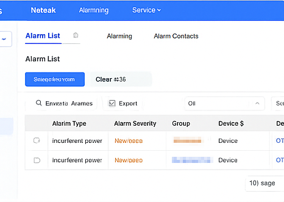
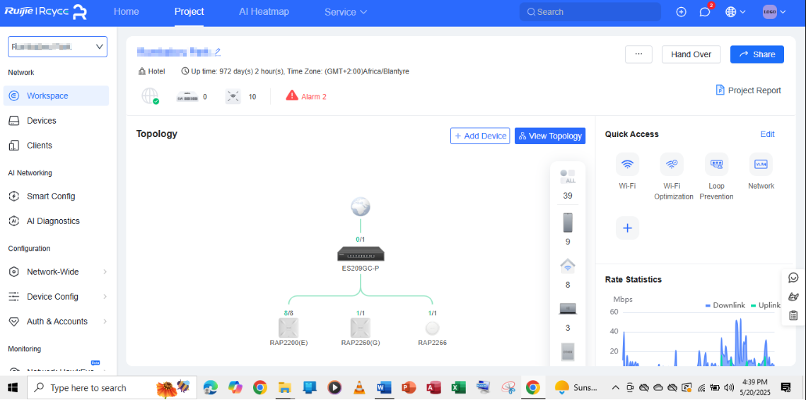

# Network monitoring and alarm response — Ruijie Reyee & Neteak NMS

## Overview

| Field | Detail |
|---|---|
| **Category** | Network monitoring / Wireless infrastructure |
| **Environment** | Hotel network — production |
| **Platform** | Ruijie Reyee Cloud NMS + Neteak Alarming |
| **Devices** | ES209GC-P PoE switch + RAP2200(E), RAP2260(G), RAP2266 APs |
| **Timezone** | GMT+2:00 Africa/Blantyre |
| **Skill level** | Intermediate |

---

## Scenario

During routine monitoring of a hotel network managed via the Ruijie Reyee cloud platform, the dashboard reported 2 active alarms and 10 offline devices. The Neteak NMS alarm list showed multiple "incoherent power" alerts with New/severity status. A Wi-Fi experience analysis was also conducted to assess wireless quality across key metrics.

---

## Screenshots

**Fig 1 — Neteak alarm list: incoherent power alerts**


**Fig 2 — Ruijie Reyee project dashboard: hotel network topology and rate statistics**


**Fig 3 — Ruijie Reyee Wi-Fi experience radar chart**


---

## What was observed

### Dashboard summary (Fig 2)
- **Uptime:** 972 days 2 hours — network has been stable long-term
- **Offline devices:** 10 — requires investigation
- **Active alarms:** 2
- **Topology:** Internet → ES209GC-P switch → 3 APs (RAP2200(E) 8/8 ports, RAP2260(G) 1/1, RAP2266 1/1)
- **Rate statistics:** Downlink spikes to ~50 Mbps, uplink relatively flat — normal hotel usage pattern

### Alarm detail (Fig 1)
- **Alarm type:** Incoherent power (x2)
- **Severity:** New (unacknowledged)
- **Affected:** Device group — likely APs experiencing PoE power inconsistency
- **Pending alarms:** 36 in queue (Clear #36 shown)

### Wi-Fi experience (Fig 3)
- Radar chart assessed across: Downlink, Uplink, Coverage, Throughput, Signal, Special Strength, Roaming, Occurrence
- Visual dip noted in Signal and Coverage axes — suggests RF dead zones or AP placement issues
- Connection status: Global (cloud-managed)

---

## Diagnostic steps

### Step 1 — Review active alarms in Neteak

1. Log in to Neteak NMS → navigate to **Alarming → Alarm List**
2. Filter by **Severity: New** to see unacknowledged alarms
3. Note the **Alarm Type** — "Incoherent power" points to PoE instability
4. Click each alarm → check **Device $** column to identify which specific device is affected
5. Export the alarm list for documentation:
   - Tick the **Export** checkbox → download CSV

---

### Step 2 — Identify affected devices in Reyee dashboard

1. Log in to Ruijie Reyee cloud → open the affected **Project**
2. Check **Devices** panel — filter for offline or alarming devices
3. Cross-reference with the alarm list — match device names/MACs
4. In the **Topology** view, look for any APs shown in grey or disconnected state

```
Healthy AP state:  connected to switch port, green indicator
Alarming AP state: yellow/red indicator, port may show 0/1 or offline
```

---

### Step 3 — Investigate incoherent power alarms

"Incoherent power" on Ruijie/Neteak typically means the PoE switch is delivering inconsistent or insufficient power to an AP. Common causes:

| Cause | Check |
|---|---|
| PoE budget exceeded | Check total PoE draw on ES209GC-P switch |
| Faulty PoE port | Swap AP to a different port and monitor |
| Damaged cable | Test cable with LAN tester or swap cable |
| AP firmware mismatch | Check AP firmware version in Reyee dashboard |
| Overheating switch | Check switch physically — ventilation clear? |

**Check PoE status via Reyee:**
1. Go to **Device Config → ES209GC-P**
2. Navigate to **PoE settings**
3. Check per-port power draw vs. budget
4. A healthy port shows stable wattage — fluctuating or 0W on an active port = problem

---

### Step 4 — Analyse Wi-Fi experience

1. In Reyee dashboard → go to **Devices → [AP name] → Wi-Fi Experience**
2. Review the radar chart (Fig 3) for dips in any axis:

| Metric | If low, check... |
|---|---|
| Signal | AP placement, distance from clients, interference |
| Coverage | Add AP or adjust transmit power |
| Throughput | Channel congestion, bandwidth limits |
| Downlink/Uplink | WAN speed, backhaul bottleneck |
| Roaming | Roaming thresholds, band steering settings |
| Occurrence | How frequently issues are occurring |

3. Navigate to **Wi-Fi → Optimization** to run AI channel optimisation if available
4. Check **Loop Prevention** status — a loop on the wired side degrades all wireless metrics

---

### Step 5 — Address offline devices

With 10 offline devices showing on the dashboard:

```bash
# If you have SSH access to the switch
ssh admin@[switch-ip]

# Check which ports are up/down
show interface status

# Check PoE status per port
show power inline

# Ping each AP's IP to confirm connectivity
ping [ap-ip-address]
```

For each offline AP:
1. Confirm it appears in Reyee under **Devices** with an offline status
2. Check physical LED on the AP — solid = powered, blinking = booting, off = no power
3. If no LED: PoE issue — check switch port
4. If blinking but offline in cloud: AP is powered but not connecting — check VLAN/SSID config or factory reset

---

### Step 6 — Acknowledge and clear alarms

Once issues are resolved:

1. In Neteak → **Alarm List** → select resolved alarms
2. Click **Snooze/Acknowledge** to mark as handled
3. Use **Clear** to remove resolved alarms from the active queue
4. Document what was found and fixed in your ticket system

---

## Resolution summary

| Issue | Root cause | Action taken |
|---|---|---|
| Incoherent power alarms | PoE instability on ES209GC-P | Investigate per-port power draw, swap cable/port |
| 10 offline devices | To be determined per device | Check PoE, physical LED, cloud connectivity |
| Wi-Fi experience dips | Signal/coverage gaps | Review AP placement, run AI optimisation |

---

## Prevention and best practices

- Schedule **weekly alarm reviews** — do not let the queue reach 36+ unacknowledged
- Enable **email/SMS alarm notifications** in Neteak so critical alarms are caught immediately
- Monitor **PoE budget** monthly — adding devices without checking budget causes incoherent power alarms
- Use Reyee's **AI Diagnostics** feature for automated root cause analysis on Wi-Fi issues
- Keep AP firmware updated via **Reyee cloud batch upgrade** to avoid compatibility issues
- Document the network topology — note which APs serve which areas of the hotel for faster fault location

---

## Related playbooks

- `wifi-authentication-issues.md`
- `remote-linux-update-via-teamviewer.md`

---

*Documented by: Tanya Jimu | Date: May 2025 | Category: Network Monitoring / Wireless*
