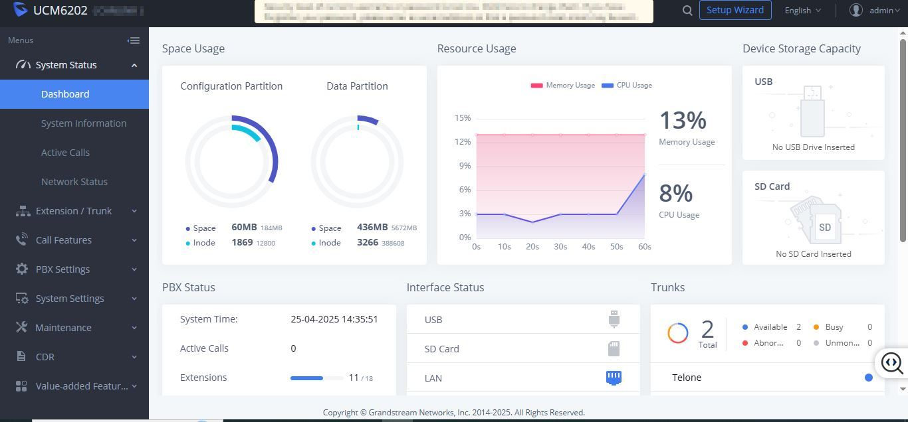
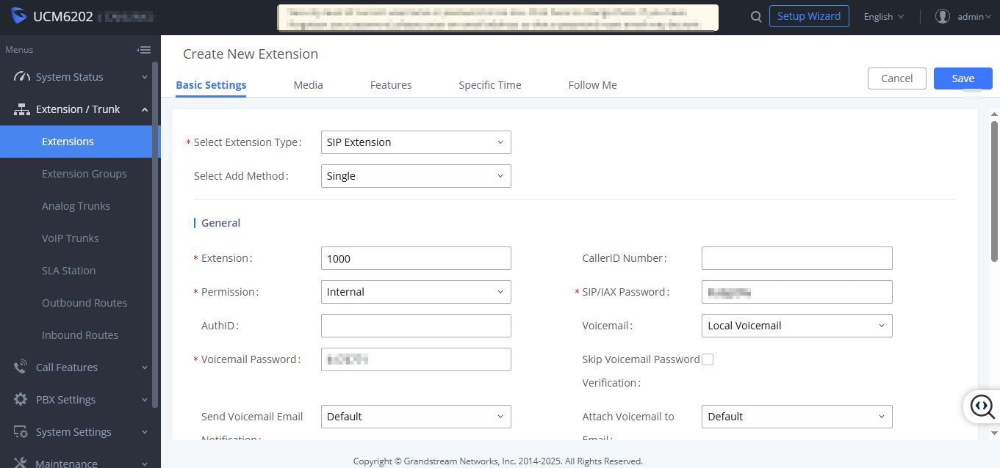
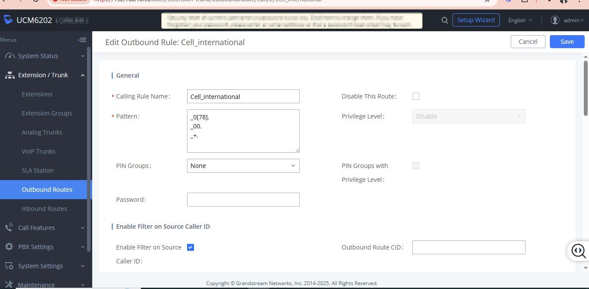

# Grandstream UCM6202 PBX administration — extension provisioning and outbound routing

## Overview

| Field | Detail |
|---|---|
| **Category** | VoIP / PBX administration |
| **Device** | Grandstream UCM6202 IP PBX |
| **SIP Trunk provider** | Telone (2 trunks configured) |
| **Task** | System health check, SIP extension creation, outbound route configuration |
| **Date** | April 2025 |
| **Skill level** | Intermediate |

---

## Scenario

Routine PBX administration session on a Grandstream UCM6202. Tasks included reviewing system health via the dashboard, provisioning a new SIP extension for an internal user, and configuring an outbound route to handle Zimbabwean mobile and international calls via the Telone SIP trunk.

---

## Screenshots

**Fig 1 — UCM6202 system dashboard: health overview**


**Fig 2 — Creating a new SIP extension (1000)**


**Fig 3 — Outbound route: Cell_international dial patterns**


---

## Part 1 — System health check

Before making any configuration changes, always review the dashboard to confirm the system is stable.

### What to check on the UCM6202 dashboard

| Metric | Healthy value | Observed |
|---|---|---|
| CPU usage | Below 50% | 8% ✅ |
| Memory usage | Below 70% | 13% ✅ |
| Active calls | Depends on time of day | 0 |
| Extensions registered | Should match deployed phones | 11/18 |
| Trunks available | All configured trunks showing Available | 2 Available ✅ |
| Abnormal trunks | Should be 0 | 0 ✅ |

### Reading the dashboard (Fig 1)

```
System Time:    25-04-2025 14:35:51
Active Calls:   0
Extensions:     11/18 registered
Trunks:         2 total — 2 Available, 0 Busy, 0 Abnormal
Memory:         13%
CPU:            8%
Config space:   60MB / 184MB used
Data space:     436MB / 5672MB used
Trunk name:     Telone (blue = active/available)
```

**Note:** 7 extensions showing as unregistered (11/18) — investigate which devices are offline before provisioning new extensions. Could indicate phones that are powered off, misconfigured, or physically disconnected.

---

## Part 2 — Creating a new SIP extension

### Step 1 — Navigate to Extensions

1. Log in to UCM6202 web interface → `http://[pbx-ip]:8089`
2. Go to **Extension/Trunk → Extensions**
3. Click **"+ Add"** to open the Create New Extension screen

### Step 2 — Basic settings (Fig 2)

Configure the following fields:

| Field | Value | Notes |
|---|---|---|
| Extension Type | SIP Extension | Standard for IP phones and softphones |
| Add Method | Single | Use "Batch" for multiple extensions at once |
| Extension number | 1000 | Use a numbering plan (e.g. 1000–1099 for staff) |
| Permission | Internal | Internal = can call extensions only; Local/National/International adds outbound |
| CallerID Number | [optional] | Displayed on outbound calls — leave blank to use trunk default |
| SIP/IAX Password | [auto-generated] | Record this — needed to register the IP phone |
| Voicemail | Local Voicemail | Stores voicemail on the UCM itself |
| Voicemail Password | [set a PIN] | User enters this to retrieve voicemail |
| Send Voicemail Email | Default | Configure SMTP first if email delivery is needed |

### Step 3 — Save and provision the phone

1. Click **Save** → then **Apply Changes** at the top of the screen
2. On the IP phone (e.g. Grandstream GXP/GRP series), enter:
   - **SIP Server:** [UCM IP address]
   - **SIP User ID:** 1000
   - **Authenticate ID:** 1000
   - **Authenticate Password:** [SIP/IAX password from above]
3. The phone should register within 30–60 seconds
4. Verify in **Dashboard → Extensions** — the extension count should increment

### Step 4 — Test the extension

```
1. Dial another registered extension from extension 1000
2. Dial *97 to access voicemail and confirm it prompts for PIN
3. Check Active Calls on dashboard during the test call — it should show 1
```

---

## Part 3 — Configuring outbound routes

Outbound routes tell the UCM which trunk to use for which dialled numbers. The `Cell_international` route handles Zimbabwean mobile and international calls via the Telone trunk.

### Understanding the dial patterns (Fig 3)

```
_0[78].        Matches any number starting with 07 or 08 (Zimbabwean mobile numbers)
               Examples: 0771234567, 0831234567

_00.           Matches any number starting with 00 (international dialling prefix)
               Examples: 00447911123456 (UK), 0012125551234 (US)

_+.            Matches E.164 format international numbers starting with +
               Examples: +447911123456, +12125551234
```

**Pattern syntax reference:**

| Symbol | Meaning |
|---|---|
| `_` | Required prefix — marks this as a pattern not a literal number |
| `0[78]` | Matches 07 or 08 |
| `.` | Matches one or more of any digit |
| `+` | Literal plus sign (for E.164) |
| `X` | Any single digit 0–9 |
| `Z` | Any digit 1–9 |
| `N` | Any digit 2–9 |

### Step-by-step: edit or create an outbound route

1. Go to **Extension/Trunk → Outbound Routes**
2. Click an existing route to edit, or **"+ Add"** for a new one
3. Fill in:

| Field | Value for Cell_international |
|---|---|
| Calling Rule Name | Cell_international |
| Pattern | `_0[78].` on line 1, `_00.` on line 2, `_+.` on line 3 |
| PIN Groups | None (add PIN for call cost control if needed) |
| Privilege Level | Disable (controlled by extension Permission instead) |
| Enable Filter on Source Caller ID | Checked — restricts which extensions can use this route |
| Password | Leave blank unless PIN-protecting the route |

4. Scroll down to **Trunk** section → select **Telone** as the trunk for this route
5. Click **Save → Apply Changes**

### Step 5 — Test outbound routing

```
1. From a registered extension, dial a Zimbabwean mobile number (e.g. 0771234567)
2. Check Active Calls on dashboard — should show 1 call going out
3. Check CDR (Call Detail Records) → verify the call used the Telone trunk
4. Test international format: dial +263771234567 — should also route via Telone
```

---

## Common issues and fixes

| Issue | Cause | Fix |
|---|---|---|
| Extension not registering | Wrong SIP password on phone | Re-enter SIP/IAX password from UCM extension settings |
| Extension registers but no audio | NAT/firewall issue | Enable NAT in UCM → PBX Settings → SIP Settings |
| Outbound calls failing | Wrong trunk selected in route | Check route → trunk assignment |
| "All circuits busy" on outbound | Trunk down or no channels free | Check trunk status on dashboard — green = available |
| Pattern not matching | Dial plan syntax error | Test pattern in UCM dialplan tester or simplify to `_0.` first |
| 7 extensions unregistered | Phones offline or misconfigured | Ping each phone IP, check SIP credentials on device |
| Voicemail not working | SMTP not configured | Set up email under System Settings → Email Settings |
| High CPU spike | Heavy call volume or active recordings | Check Active Calls, disable call recording if not needed |

---

## Security best practices for UCM6202

- **Change the default admin password** immediately after first login
- **Disable guest SIP calls** — PBX Settings → SIP Settings → Disable Guest Calls
- **Use strong SIP passwords** — auto-generated passwords are safer than simple ones
- **Enable fail2ban** — System Settings → Security Settings → Fail2Ban to block brute force attempts
- **Restrict web UI access** by IP — only allow admin access from trusted IPs
- **Enable PIN groups** on international routes to prevent unauthorised expensive calls
- **Review CDR weekly** — unexpected international calls may indicate a compromised extension

---

## Related playbooks

- `dns-resolution-failures.md`
- `remote-linux-update-via-teamviewer.md`
- `network-monitoring-alarm-response-ruijie-reyee.md`

---

*Documented by: Tanya Jimu | Date: April 2025 | Category: VoIP / PBX Administration*
