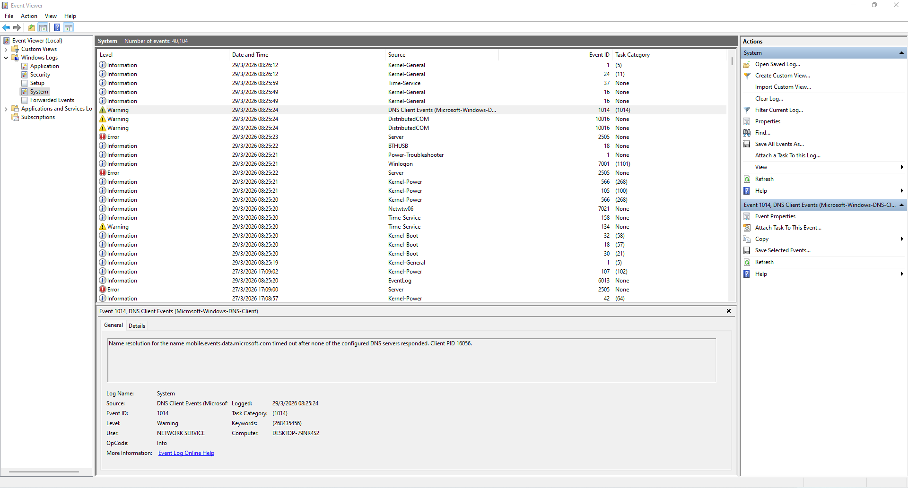
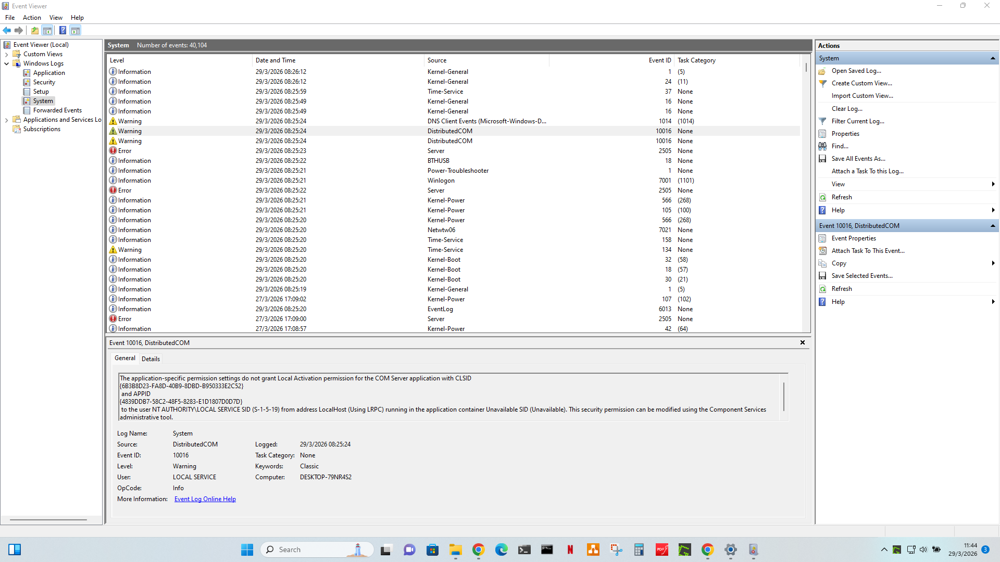

# Windows Event Viewer — diagnosing Event 1014 (DNS timeout) and Event 10016 (DCOM permission warning)

## Overview

| Field | Detail |
|---|---|
| **Category** | Windows diagnostics / Event log analysis |
| **Tool** | Windows Event Viewer |
| **Log** | Windows Logs → System |
| **Events covered** | Event ID 1014, Event ID 10016 |
| **Computer** | DESKTOP-79NR4S2 |
| **Date observed** | 29/03/2026 08:25:24 |
| **Skill level** | Beginner–Intermediate |

---

## Scenario

During routine Event Viewer analysis on a Windows 11 machine, two recurring Warning events were identified in the System log at startup. Both events appeared at 08:25:24 during the same boot sequence. This playbook documents what each event means, how to assess severity, and what action (if any) is required.

---

## Screenshots

**Fig 1 — Event 1014: DNS Client timeout warning**


**Fig 2 — Event 10016: DistributedCOM permission warning**


---

## How to open Event Viewer

```
Method 1: Win + R → type eventvwr.msc → Enter
Method 2: Start menu → search "Event Viewer" → Open
Method 3: Right-click Start button → Event Viewer
```

Navigate to: **Windows Logs → System**

To filter for Warnings and Errors only:
1. Right-click **System** → **Filter Current Log**
2. Tick **Warning** and **Error** → click OK
3. This clears the noise and shows only events worth investigating

---

## Event 1 — Event ID 1014: DNS Client timeout

### What the event says
```
Log Name:   System
Source:     DNS Client Events (Microsoft-Windows-DNS-Client)
Event ID:   1014
Level:      Warning
Time:       29/3/2026 08:25:24
User:       NETWORK SERVICE
Computer:   DESKTOP-79NR4S2

Message:
Name resolution for the name mobile.events.data.microsoft.com 
timed out after none of the configured DNS servers responded. 
Client PID 16056.
```

### What it means

The DNS client tried to resolve `mobile.events.data.microsoft.com` — a Microsoft telemetry/diagnostics endpoint — but no DNS server responded in time. This is a **transient DNS failure** that occurred early in the boot sequence before the network was fully initialised.

**Severity: Low** — this is almost always benign on a home or office machine.

### Why it happens

| Cause | Explanation |
|---|---|
| Early boot timing | Windows services start before the network adapter is fully ready |
| DNS server slow to respond | Router/ISP DNS hadn't responded within the timeout window |
| Network adapter initialising | NIC takes a few seconds to establish connection after boot |
| DNS server unreachable | Temporary DNS server outage — usually self-resolves |

### How to investigate

**Step 1 — Check if DNS is working now:**
```powershell
# Open PowerShell and test DNS resolution
Resolve-DnsName google.com
Resolve-DnsName mobile.events.data.microsoft.com

# Check configured DNS servers
Get-DnsClientServerAddress
```

**Step 2 — Check if the event is recurring during normal use:**
- If Event 1014 only appears at startup → normal, no action needed
- If Event 1014 appears throughout the day → investigate DNS server stability

**Step 3 — Check DNS server response time:**
```powershell
# Ping your DNS server (usually your router)
ping 192.168.1.1

# Test DNS resolution speed
nslookup google.com
nslookup google.com 8.8.8.8
```

**Step 4 — Flush DNS cache if issues persist:**
```cmd
ipconfig /flushdns
ipconfig /registerdns
```

### Resolution

| Scenario | Action |
|---|---|
| Event only at startup, DNS works fine now | No action required — normal boot behaviour |
| Event recurring throughout the day | Change DNS to a faster server (8.8.8.8 or 1.1.1.1) |
| No internet connectivity at all | Check NIC, cable, router — DNS failure is a symptom not the cause |

**To change DNS server (if needed):**
```
Settings → Network & Internet → [Your connection] → DNS server assignment
→ Manual → IPv4 → Preferred: 8.8.8.8, Alternate: 8.8.4.4
```

---

## Event 2 — Event ID 10016: DistributedCOM permission warning

### What the event says
```
Log Name:   System
Source:     DistributedCOM
Event ID:   10016
Level:      Warning
Time:       29/3/2026 08:25:24
User:       LOCAL SERVICE
Computer:   DESKTOP-79NR4S2

Message:
The application-specific permission settings do not grant Local 
Activation permission for the COM Server application with CLSID
{6B3B8D23-FA8D-40B9-8DBD-B950333E2C52}
and APPID
{4839DDB7-58C2-48F5-8283-E1D1807D0D7D}
to the user NT AUTHORITY\LOCAL SERVICE SID (S-1-5-19) from 
address LocalHost (Using LRPC) running in the application 
container Unavailable SID (Unavailable).
This security permission can be modified using the Component 
Services administrative tool.
```

### What it means

A Windows system service running as `NT AUTHORITY\LOCAL SERVICE` attempted to activate a COM server component (identified by its CLSID) but did not have the required permission to do so. Windows logged this as a warning.

**Severity: Low** — Event 10016 is one of the most common Event Viewer warnings on Windows 10/11. Microsoft has acknowledged it as a known cosmetic issue that does not affect system functionality in most cases.

### Why it happens

DCOM (Distributed Component Object Model) is the Windows framework that allows applications and services to communicate. Some built-in Windows components have permission mismatches where the service account (`LOCAL SERVICE`) isn't explicitly granted activation rights for a COM object — even though the system functions correctly.

This specific CLSID/APPID combination is commonly associated with Windows Runtime broker services that initialise during startup.

### How to investigate

**Step 1 — Identify which application the CLSID belongs to:**
```
Win + R → dcomcnfg → Enter
Component Services → Computers → My Computer → DCOM Config
Search for the APPID: {4839DDB7-58C2-48F5-8283-E1D1807D0D7D}
```

**Step 2 — Check if the warning is causing any actual problem:**
- Is the system running normally?
- Are any applications crashing or failing to start?
- If no — the warning is cosmetic and can be safely noted and ignored

**Step 3 — Check frequency:**
- If 10016 appears only at startup → cosmetic, no action needed
- If 10016 appears hundreds of times → may indicate an application loop worth investigating

### Resolution

| Scenario | Action |
|---|---|
| Appears at startup only, system works fine | Document and monitor — no fix required |
| Application is crashing alongside this event | Investigate the application in Application log |
| Appears constantly throughout uptime | Use Component Services to grant LOCAL SERVICE activation permission |

**Advanced fix — grant DCOM permission (only if causing issues):**
```
1. Win + R → dcomcnfg
2. Navigate to DCOM Config → find the application by APPID
3. Right-click → Properties → Security tab
4. Under Launch and Activation Permissions → Edit
5. Add NT AUTHORITY\LOCAL SERVICE → tick Local Activation → OK
6. Restart the service or reboot
```

> ⚠️ Only modify DCOM permissions if you are certain the event is causing a problem. Incorrect DCOM permission changes can affect system stability.

---

## Reading the System log effectively — quick reference

| Event ID | Source | Meaning | Typical severity |
|---|---|---|---|
| 1014 | DNS-Client | DNS timeout | Low — usually startup noise |
| 10016 | DistributedCOM | COM permission warning | Low — very common on Win 10/11 |
| 41 | Kernel-Power | Unexpected shutdown | High — investigate immediately |
| 6008 | EventLog | Previous shutdown unexpected | High |
| 7034 | Service Control | Service crashed | Medium–High |
| 7036 | Service Control | Service started/stopped | Informational |
| 6013 | EventLog | System uptime in seconds | Informational |
| 2505 | Server | Server could not bind to transport | Medium |

---

## Best practices for Event Viewer analysis

- **Filter before you dig** — always filter by Warning/Error first, don't scroll through 40,000 events
- **Look for clusters** — multiple errors at the same timestamp usually mean one root cause
- **Startup noise is normal** — many warnings appear at boot as services race to initialise
- **Cross-reference logs** — check both System and Application logs together for a complete picture
- **Use Event ID as a search term** — searching "Event ID 1014" gives Microsoft documentation and community fixes instantly
- **Export logs before wiping** — before reimaging a machine, export the event log as `.evtx` for post-mortem analysis:
  ```
  Right-click System log → Save All Events As → .evtx format
  ```

---

## Related playbooks

- `dns-resolution-failures.md`
- `network-monitoring-alarm-response-ruijie-reyee.md`

---

*Documented by: Tanya Jimu | Date: March 2026 | Category: Windows Diagnostics / Event Log Analysis*
